# Project Graph

This file is the low-token entry point for repo-wide tasks.

Use it before loading large groups of source files.

## Product Boundary

- The active shell imports and opens EPUB only.
- EPUB library entries can route into the Edit Book flow.
- PDF-origin books may still appear in library metadata.
- Active PDF open/import stays intentionally disabled.

## Current Modules

- `:app` is the builder/bootstrap module.
- `:core:model` and `:core:ui` hold shared contracts and presentation helpers.
- `:data:settings` and `:data:books` hold persistence and parser/runtime code.
- `:feature:library`, `:feature:reader`, `:feature:settings`, `:feature:editbook`, and `:feature:pdf-legacy` each expose one root feature lego/plugin plus internal helper legos.
- `checkKotlinFileLineLimit` enforces the repo-wide 500-line Kotlin cap.

## Default Graph-First Flow

1. Read `docs/project_graph.md`.
2. If present, read `graphify-out/GRAPH_REPORT.md`.
3. If scope is still unclear, run `graphify query "<question>" --budget 1200`.
4. Read one focused area doc.
5. Open only the files named by the graph and that area doc.

## Query Examples

```text
graphify query "What owns folder ordering and drag preview?" --budget 900
graphify query "Which files control reader restoration and progress saving?" --budget 900
graphify query "Where is metadata.json read and written?" --budget 900
graphify query "What should I open first for builder or library plugin folder bugs?" --budget 900
graphify query "Which files own Edit Book save validation and chapter mutation?" --budget 900
```

## Whole-Project Map

```mermaid
flowchart TD
    MainActivity[MainActivity]

    MainActivity --> AppShell[app/AppNavigation]
    MainActivity --> ScreenEnum[MainActivity Screen enum]

    AppShell --> AppRoute[app/AppRoute]
    AppShell --> Registry[app/AppFeatureRegistry]
    AppShell --> AppStartup[app/AppNavigationStartupEffect]
    AppShell --> AppHost[app/AppNavigationScreenHost]
    AppShell --> AppEffects[app/AppNavigationEffects]
    AppShell --> SettingsManager[data/settings/SettingsManager]
    AppShell --> EpubParser[data/parser/EpubParser]

    AppHost --> LibraryPlugin[feature/library/LibraryLegoPlugin]
    AppHost --> SettingsPlugin[feature/settings/SettingsLegoPlugin]
    AppHost --> ReaderPlugin[feature/reader/ReaderLegoPlugin]
    AppHost --> EditBookPlugin[feature/editbook/EditBookLegoPlugin]

    LibraryPlugin --> LibraryContent[feature/library/internal/LibraryFeatureContent]
    LibraryContent --> LibraryData[feature/library/internal/LibraryFeatureData]
    LibraryContent --> LibraryOps[feature/library/internal/LibraryFeatureOperations]
    LibraryContent --> LibraryUi[feature/library/internal/ui/*]

    SettingsPlugin --> SettingsScreen[feature/settings/SettingsScreen]

    ReaderPlugin --> Lookup[data/parser/EpubParserLookup]
    ReaderPlugin --> ReaderScreen[feature/reader/ReaderScreen]
    ReaderScreen --> ReaderContracts[feature/reader/ReaderScreenContracts]
    ReaderScreen --> ReaderChrome[feature/reader/ReaderScreenChrome]
    ReaderScreen --> ReaderControls[feature/reader/ReaderScreenControls]

    EditBookPlugin --> Lookup
    EditBookPlugin --> EditBookScreen[feature/editbook/EditBookScreen]

    SettingsManager --> SettingsContracts[data/settings/SettingsManagerContracts]
    SettingsManager --> SettingsJson[data/settings/SettingsManagerJson]

    EpubParser --> Lookup
    EpubParser --> ParserBooks[data/parser/EpubParserBooks]
    EpubParser --> ParserEditing[data/parser/EpubParserEditing]
    EpubParser --> ParserChapter[data/parser/EpubParserChapter]

    CoreModels[core/model/*] --> AppShell
    CoreModels --> ReaderScreen
    CoreModels --> SettingsManager
    CoreModels --> EpubParser

    CoreUi[core/ui/FeatureLegoPlugin + shared UI] --> LibraryPlugin
    CoreUi --> SettingsPlugin
    CoreUi --> ReaderPlugin
    CoreUi --> EditBookPlugin
```



## Task Routing

### App Shell

- Read `docs/app_shell_navigation.md`.
- Start with `app/AppRoute.kt` for the builder route map.
- Then read `app/AppFeatureRegistry.kt` and `app/AppNavigation.kt`.
- Open `app/AppNavigationScreenHost.kt` only when the issue is about plugin mounting or screen transitions.

### Library

- Read `docs/app_shell_navigation.md`.
- Start with `feature/library/LibraryLegoPlugin.kt`.
- Then open `feature/library/internal/LibraryFeatureContent.kt` and one focused helper file only.

### Settings / Persistence

- Read `docs/settings_persistence.md`.
- Start with `feature/settings/SettingsLegoPlugin.kt` if the issue begins at the builder boundary.
- Start with `data/settings/SettingsManagerContracts.kt` for keys/defaults.
- Then read `data/settings/SettingsManager.kt` for behavior.

### Parser / Edit Book Runtime

- Read `docs/epub_parsing.md`.
- Start with `data/parser/EpubParser.kt`.
- Open `EpubParserLookup.kt` when the issue is route-id based book loading.
- Open `EpubParserBooks.kt`, `EpubParserEditing.kt`, or `EpubParserChapter.kt` only for the focused subpath.

### Reader

- Read `docs/reader_screen.md`.
- Start with `feature/reader/ReaderLegoPlugin.kt`.
- Then read `feature/reader/ReaderScreen.kt`.
- Open `ReaderScreenChrome.kt` or `ReaderScreenControls.kt` only for that specific surface.

### Edit Book UI

- Start with `feature/editbook/EditBookLegoPlugin.kt`.
- Then read `feature/editbook/EditBookScreen.kt`.
- Then read `docs/epub_parsing.md` if the task touches EPUB mutation behavior.

### Verification

- Read `docs/test_checklist.md` after the graph narrows the production area.
- Prefer JVM/local coverage first unless the task clearly depends on runtime UI behavior.

## Rebuild

Run `python scripts/check_graph_staleness.py --rebuild` after meaningful documentation or structural changes.
