# Project Graph

This file is the low-token entry point for repo-wide tasks.

Use it before loading large groups of source files.

## Why This Exists

- `graphify-out/GRAPH_REPORT.md` gives the shortest whole-project structural summary.
- `graphify-out/wiki/index.md` gives a browsable graph index.
- `graphify query` can answer "where should I look?" before an agent opens raw files.
- The area docs still matter, but they should come after the graph narrows scope.

## Default Graph-First Flow

1. Read `docs/project_graph.md`.
2. If present, read `graphify-out/GRAPH_REPORT.md`.
3. If scope is unclear or spans multiple packages, run:
   - `graphify query "<question>" --budget 1200`
4. Read only the relevant area doc:
   - `docs/app_shell_navigation.md`
   - `docs/settings_persistence.md`
   - `docs/epub_parsing.md`
   - `docs/reader_screen.md`
   - `docs/test_checklist.md`
5. Open only the specific source files named by the graph and the area doc.

## Budget Guide

- `400-800`: quick "where is this handled?" lookups
- `800-1500`: normal bug-fix or refactor scoping
- `1500-2500`: cross-package architecture/debug tasks

Stay small first. Only increase the budget if the graph answer is obviously incomplete.

## Rebuild

The graph should be kept in sync with code and documentation changes.

**Manual Rebuild**:
```text
python scripts/rebuild_graphify.py
```

**Automated Check & Rebuild**:
Use the staleness checker to verify if the graph is out of date:
```text
python scripts/check_graph_staleness.py
```

To automatically rebuild ONLY if stale:
```text
python scripts/check_graph_staleness.py --rebuild
```

This ensures `graphify-out/` reflects the latest `docs/*.md` and core source logic.

## Query Examples

```text
graphify query "What owns folder ordering and drag preview?" --budget 900
graphify query "Which files control reader restoration and progress saving?" --budget 900
graphify query "Where is metadata.json read and written?" --budget 900
graphify query "What should I open first for AppNavigation folder bugs?" --budget 900
```

## Whole-Project Map

```mermaid
flowchart TD
    MainActivity[MainActivity]

    MainActivity --> AppShell[app/AppNavigation]
    MainActivity --> SettingsScreen[feature/settings/SettingsScreen]

    AppShell --> AppContracts[app/AppNavigationContracts]
    AppShell --> AppStartup[app/AppNavigationStartup]
    AppShell --> AppOps[app/AppNavigationOperations]
    AppShell --> AppData[app/AppNavigationLibraryData]
    AppShell --> AppLibrary[app/AppNavigationLibrary]
    AppShell --> AppDialogs[app/AppNavigationDialogs]
    AppShell --> SettingsManager[data/settings/SettingsManager]
    AppShell --> EpubParser[data/parser/EpubParser]
    AppShell --> ReaderScreen[feature/reader/ReaderScreen]

    SettingsManager --> SettingsContracts[data/settings/SettingsManagerContracts]
    SettingsManager --> SettingsJson[data/settings/SettingsManagerJson]

    EpubParser --> ParserBooks[data/parser/EpubParserBooks]
    EpubParser --> ParserChapter[data/parser/EpubParserChapter]

    ReaderScreen --> ReaderContracts[feature/reader/ReaderScreenContracts]
    ReaderScreen --> ReaderChrome[feature/reader/ReaderScreenChrome]
    ReaderScreen --> ReaderControls[feature/reader/ReaderScreenControls]
    ReaderScreen --> SettingsManager
    ReaderScreen --> EpubParser

    CoreModels[core/model/*] --> AppShell
    CoreModels --> ReaderScreen
    CoreModels --> SettingsManager
    CoreModels --> EpubParser

    CoreUi[core/ui/LibraryCards] --> AppLibrary
```



## Task Routing

### App Shell

- Query first if the bug crosses folders, import, dialogs, or startup.
- Then read `docs/app_shell_navigation.md`.
- Start with `app/AppNavigationContracts.kt` for the shell surface map or `app/AppNavigation.kt` for behavior.

### Settings

- Query first if the bug crosses folder order, groups, favorites, or progress persistence.
- Then read `docs/settings_persistence.md`.
- Start with `data/settings/SettingsManagerContracts.kt`, then `data/settings/SettingsManager.kt`.

### Parser

- Query first if the bug crosses import, metadata cache, TOC, chapter parsing, or image resolution.
- Then read `docs/epub_parsing.md`.
- Start with `data/parser/EpubParser.kt`.

### Reader

- Query first if the bug crosses restoration, progress save, TOC, controls, or overscroll.
- Then read `docs/reader_screen.md`.
- Start with `feature/reader/ReaderScreen.kt`.

### Tests

- Read `docs/test_checklist.md` after the graph identifies the production area.
- Prefer JVM tests first unless the graph points to Android runtime or UI behavior.
